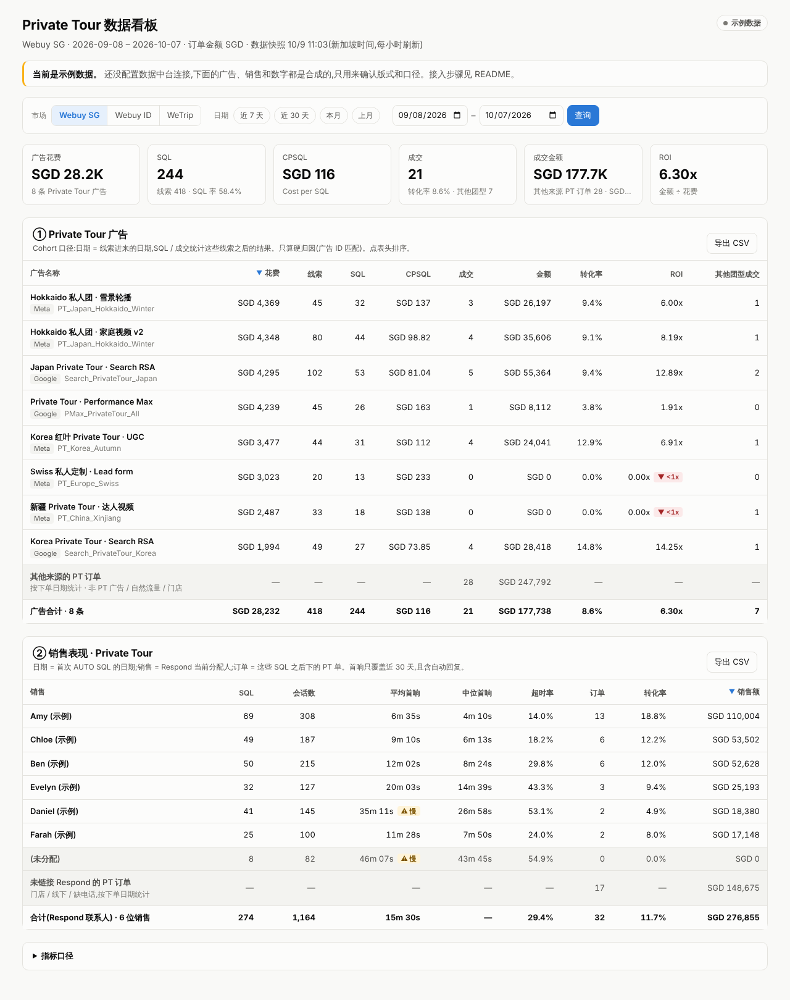

# Private Tour 数据看板

盯 Private Tour 的投放和销售跟进:哪条广告带来 SQL、每个 SQL 花多少钱、最后成交多少;每个销售接了多少 SQL、回复多快、成交多少。



> 截图是**示例数据**(合成的广告、销售和数字)。没配 Supabase 时看板自动进入示例模式,用来确认版式和口径。

## 看板内容

**顶部 6 个数**:广告花费 · SQL · CPSQL · 成交 · 成交金额 · ROI(每个数下面附 “广告归因” 的那部分)。

**表 1:Private Tour 广告**

| 列 | 算法 |
|---|---|
| 广告名称 | 广告名 + 平台 + 广告系列 |
| 花费 | 区间内该广告花费 |
| SQL | 区间内**首次**成为 SQL、且 last-touch 是这条广告的联系人数 |
| CPSQL | 花费 ÷ SQL |
| 成交 | 区间内付款、last-touch 是这条广告的订单数 |
| 金额 | 上述订单金额合计 |
| 转化率 | 成交 ÷ SQL |
| ROI | 金额 ÷ 花费(倍数;未扣成本。要毛利 ROI 需接成本数据) |

末尾固定一行 **“未归因到 PT 广告”**:命中 Private Tour 规则(lifecycle / travel type / 产品)但不是从 PT 广告进来的线索和订单,不丢。合计分两行:广告合计、Private Tour 总计(含未归因,混合口径)。

**表 2:销售表现**

| 列 | 算法 |
|---|---|
| 销售 | Respond.io 当前分配人(→ SkyBear salesId);没分配的归 “(未分配)” |
| SQL | 区间内首次成为 SQL 的 Private Tour 联系人 |
| 会话数 | 首条客户消息落在区间内的 Private Tour 会话 |
| 平均首响 / 中位首响 | 客户第一条消息 → 销售第一次回复;未回复不进平均值 |
| 超时率 | 未回复或首响 > 30 分钟的会话占比(与 sales-leads-quality-hub 日报同阈值) |
| 订单 / 销售额 | 区间内付款的 Private Tour 订单,归给该联系人的销售 |
| 转化率 | 订单 ÷ SQL |

两张表都能点表头排序、导出 CSV;可切市场(Webuy SG / Webuy ID / WeTrip)和日期(近 7 天 / 近 30 天 / 本月 / 上月 / 自定义)。日期按市场本地时区切日。

## 数据怎么连(读 `webuytravel/ai-project-template` 得出的接法)

按模板的决策树:内部 dashboard = **INTERNAL_TOOL → PLAYBOOK 04 → Vercel + Supabase**,数据放在公司**数据平台 Supabase**(模板 infra map:“Supabase = 中央数据平台,Dashboards 从这里读”)。不直连华为云 Travel MySQL(模板禁止在核心后台做分析查询),也不新建账号 / 新库(F21–F22)。

广告 → 线索 → 订单的归因数据,`webuy-tracking-system` 已经写在数据平台的 `tracking` schema 里,看板直接复用:

```
广告点击(网站 / CTWA)                Respond.io                     支付回调
        │ short_code + ad_id              │ 阶段 WA_Contact/SQL/Deal       │ purchase + 金额
        ▼                                 ▼                                ▼
tracking.tracking_clicks ◄─short_code─ tracking.lead_stage_history   tracking.order_conversion_events
        │                                 │                                │
        └──────────────── reporting.pt_ad_performance / pt_sales_performance ┘
                                 ▲                 ▲
              reporting.ad_spend_daily     reporting.lead_sales_facts      ← 本项目新增的两张输入表
              (Meta / Google 花费)         (销售归属 + 首响时间)
                                 │
                       Next.js 看板(Vercel,Supabase Auth 登录)
```

| 指标 | 来源 | 状态 |
|---|---|---|
| 广告点击、ad_id、追踪码 | `tracking.tracking_clicks` | ✅ 已有 |
| SQL | `tracking.lead_stage_history`(stage = 'SQL') | ✅ 已有 |
| 成交、金额 | `tracking.order_conversion_events`(purchase) | 🟡 目前只接了 ID 和 WeTrip,**SG 订单还没进** |
| 广告花费 | `reporting.ad_spend_daily` | 🟡 新表,需要同步任务 |
| 销售归属、首响时间、lifecycle | `reporting.lead_sales_facts` | 🟡 新表,需要 Respond.io 轮询顺带写 |
| 什么算 Private Tour | `reporting.pt_rules` | ✅ 新表,带默认规则,可改 |

看板本身**只能调两个函数**,不读任何表:函数是 `SECURITY DEFINER`,入口先查 `reporting.dashboard_viewers`(邮箱 × 市场白名单),输出只有聚合数,不含客户手机号 / 邮箱 / 姓名 / contact id。SG、ID 数据按人分别授权。

## 上线前还要做的事

按先后顺序。括号里是建议的负责人(来自各仓库 PROJECT.md)。

1. **执行迁移**(数据平台 DBA · 显方):`supabase/migrations/` 两个文件;在 Supabase → API → Exposed schemas 加 `reporting`;把看板用户加进 `reporting.dashboard_viewers`。
2. **广告花费同步**(Marketing Tech):每天把 Meta Insights(level=ad)和 Google Ads(ad_group_ad, cost_micros)写进 `reporting.ad_spend_daily`。按 PLAYBOOK 05 做成 Cloudflare Worker cron(`webuy-pt-ad-spend-sync-prod`)。数据平台如果已有广告花费 / 广告维表,建一个同名 view 指过去就行,函数不用改。
3. **销售事实**(Sales Ops / Respond.io 轮询 owner):把 `assignee` → salesId、`lifecycle`、首条客户消息时间、首次回复时间写进 `reporting.lead_sales_facts`。`sales-leads-quality-hub` 的日报已经在算首响(`daily-report.js`),逻辑可直接搬。
4. **SG 订单**(tracking · Luna):`order_conversion_events` 目前只允许 `id` / `wetrip`。SG 看板要有成交数,需要把 SkyBear SG 的付款事件也接进来(同一个 webhook 契约)。在这之前 SG 的成交 / 金额 / ROI 会显示 0。
5. **确认 Private Tour 规则**(Product + Marketing):默认 “广告系列或广告名含 private” + Respond.io lifecycle `tour private` + travel type `Private Trip`。如果广告命名约定是 `PT_` 前缀,往 `reporting.pt_rules` 加一行 `('campaign_name_ilike', 'PT\_%')`。
6. **部署**(owner):公司 Vercel team 新建项目 `private-tour-dashboard`,Root Directory 选 `dashboards/private-tour`,配 `.env.example` 里的 3 个变量。Supabase 凭据按 `ai-project-template/COMPLIANCE/access-request.md` 申请,不要自己注册账号。

## 接入数据中台

先跑只读体检 `supabase/checks/preflight.sql`(只输出聚合数):确认函数依赖的列都在、各市场近 30 天的点击 / SQL / 订单量、SQL 能归因到广告的比例、哪些市场已有 purchase 事件。结果没问题再执行迁移。

让 AI 助手(Claude Code 云端会话)直接查数据中台,二选一:

| 方式 | 怎么开 | 权限 |
|---|---|---|
| **Supabase 连接器(推荐)** | claude.ai → Settings → Connectors 添加 Supabase,用公司 Supabase 组织账号授权;或自定义连接器 `https://mcp.supabase.com/mcp?project_ref=<数据中台 ref>&read_only=true` | 只读、只限数据中台这一个 project |
| 环境变量 | 云端环境设置 → Edit → 环境变量 `DATA_PLATFORM_SUPABASE_URL` + 只读凭据 | 取决于凭据;不要用 service_role / 个人 access token |

凭据按 `ai-project-template/COMPLIANCE/access-request.md` 找 IT lead 申请,不要贴进聊天。云端环境只放行 HTTPS,Postgres 直连端口(5432 / 6543)不通,所以 `psql` 连接串在云端用不了。

迁移本身(`supabase/migrations/`)按 tracking 仓库的惯例由数据中台 DBA review 后执行,AI 只读接入不负责写库。

## 本地运行

```bash
cd dashboards/private-tour
npm ci
npm run dev          # http://localhost:3000;不配 .env.local 就是示例数据模式
npm run typecheck
npm run test:sql     # 用内嵌 Postgres 跑迁移 + 合成数据,校验两个函数的口径和权限
```

连真实数据:复制 `.env.example` 为 `.env.local`(已 gitignore),填 Supabase URL 和 anon key,用白名单里的公司邮箱登录。

## 文件

```
dashboards/private-tour/
├── app/
│   ├── page.tsx                 看板页(服务端取数)
│   ├── components/              KPI 卡片、两张表、筛选条、通用排序表
│   ├── login/ · auth/           Supabase 邮件链接登录 / 回调 / 退出
│   └── globals.css              浅色 / 深色主题
├── lib/
│   ├── data.ts                  调 reporting 函数;没配置时走示例数据
│   ├── metrics.ts               CPSQL / 转化率 / ROI / 合计与格式化
│   ├── query.ts                 URL 参数 → 市场与日期
│   └── demo-data.ts             合成示例数据
├── supabase/
│   ├── migrations/              reporting schema:输入表 + 两个看板函数
│   ├── checks/preflight.sql     接入前只读体检
│   └── tests/functions.test.mjs SQL 口径测试
├── CLAUDE.md · PROJECT.md       ai-project-template 要求的项目文件
└── .env.example
```
